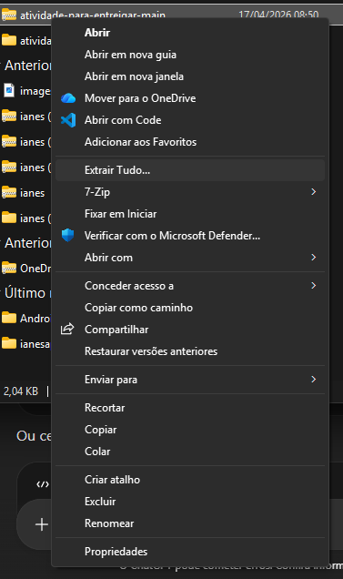

# **Companhias e seus voo**
# Henry Avelino e Pedro Yuuki
#### Descrição breve:
#### Código relacionamento 1:N de Empresas e viagens, sendo Empresa o "pai" e Viagens o "filho". Código organizado fácilmente comprensivel. Com CRUD e Banco de dados completo,E um menu com objetivo de ser intuitivo e facilitar ao máximo a navegação e uso do usuário.
### FAQ:
# Qual o publico alvo do código?
- O código é direcionado para companhias aeras, o código permite cadastrar companhias e marcar voos para todas as localidades e horários.
# Qual o objetivo do código?
- Agilizar e organizar o dia a dia das empresas ao cadastrar e gerencias seus voos nos aeroportos.
# Como funciona o relacionamento das tabelas?
#### Temos duas tabelas no código, sendo elas:
- Empresas: aonde a empresa vai de autocadastrar no nosso sistema de banco de dados, sendo necessário o nome e cnpj da empresa.
- Viagens: aonde as empresas vão cadastrar suas viagens, sendo necessário o horário e destino no cadastro.
A tabela "empresa" é a tabela pai (onde os voos vão ser manipulados), "viagens" sendo a filha.
# O código tem uma navegação fácil?
- Sim, o código tem um menu para facilitar qualquer movimento do usuário.

# Como Usar? 
### Siga as instruções:
#### Faça download do arquivo zip pelo nosso repositorio do github [segue a imagem]

#### Extraia o arquivo .zip no seu dispositivo e abra no executor de códigos

# *ACABOU*
